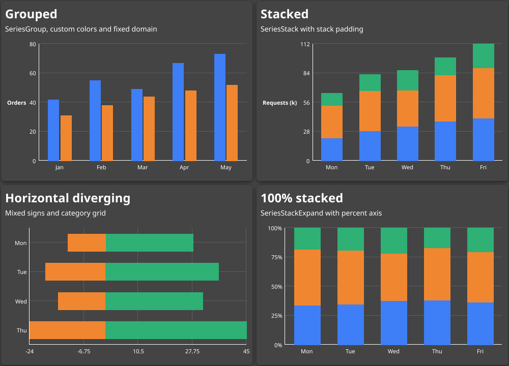
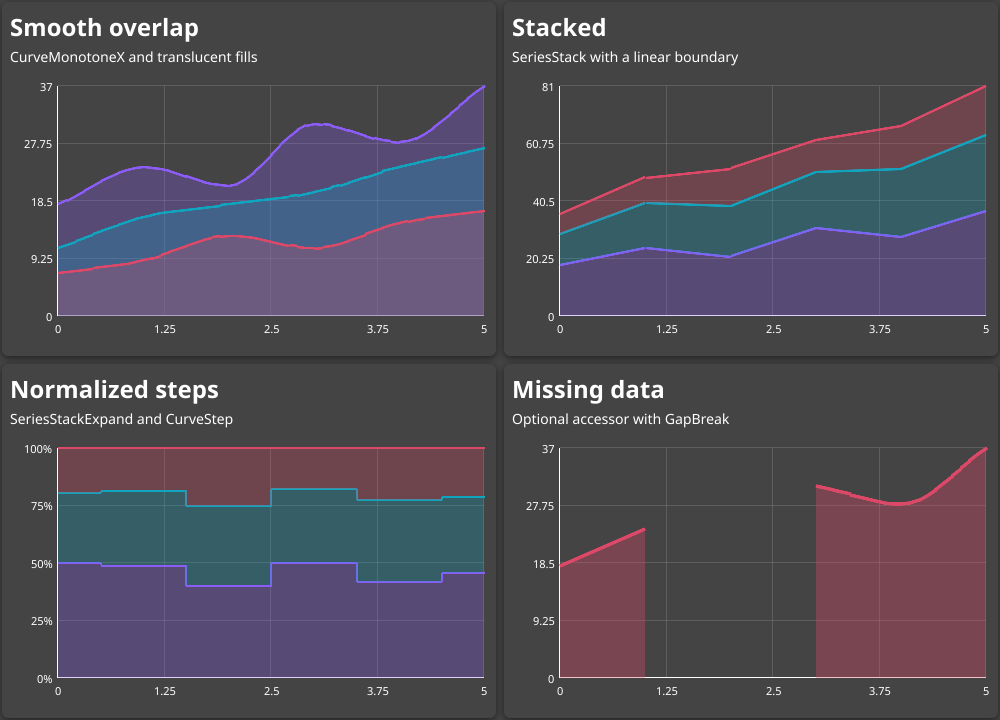
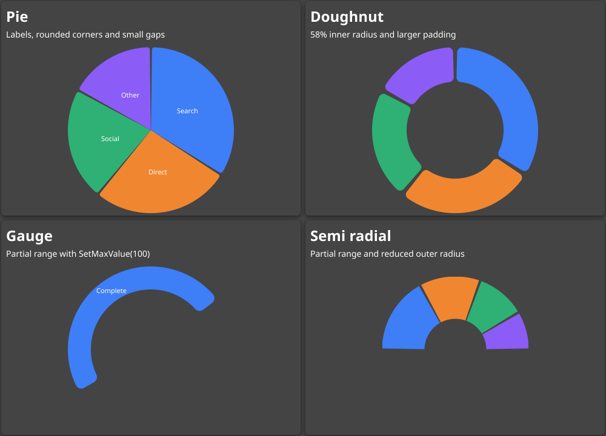
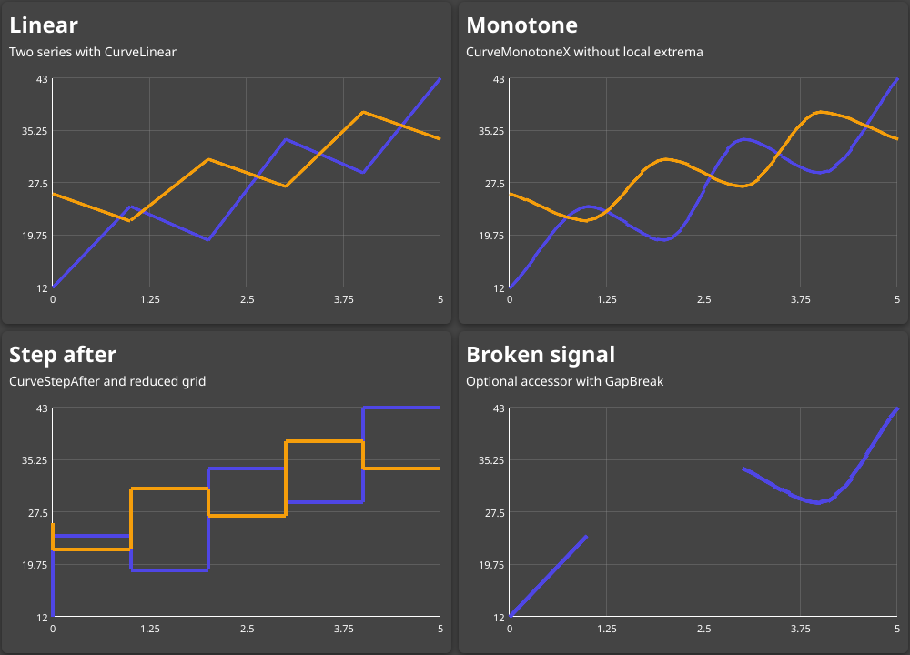

# Fyneline Examples

Each folder is a runnable Fyne project containing four configurations of one
chart component. The screenshots below are generated from the same `Gallery`
objects used by the applications.

## Render screenshots

Run these commands from this `examples` folder:

```bash
# Regenerate every screenshot.
make render

# Regenerate one screenshot.
make render EXAMPLE=bar-chart

# Shorthand targets are also available.
make bar-chart
make area-chart
make arc-chart
make spline
```

The renderer uses Fyne's headless software painter and writes
`<example>/screenshot.png`. The generated files are committed because the root
README and the project READMEs link to them.

## BarChart

[Source and instructions](bar-chart/)



## AreaChart

[Source and instructions](area-chart/)



## ArcChart

[Source and instructions](arc-chart/)



## Spline

[Source and instructions](spline/)


